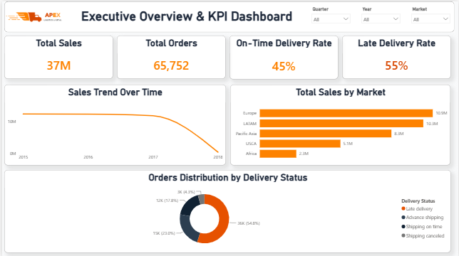
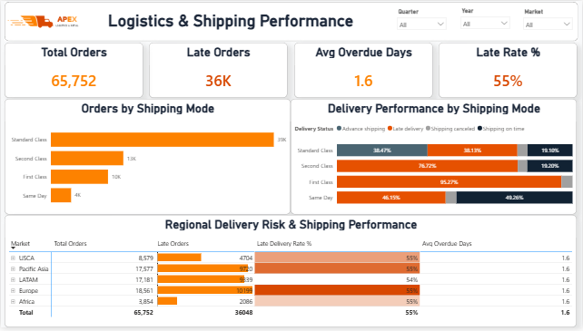
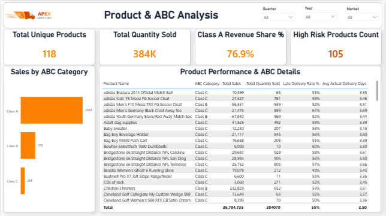

# 🚚 APEX Logistics & Retail — Supply Chain & Logistics Analytics (Power BI)


## 📌 Executive Summary
This Power BI analytics project delivers an end-to-end performance audit for **APEX Logistics & Retail**, evaluating supply chain operational friction, shipping delays, and inventory risks across **180,519 total shipments**.

While total generated revenue reached **$36,784,735 ($36.78M)** across 384,079 units sold, the diagnostic analysis uncovered a critical operational bottleneck: an overall **Late Delivery Rate of 55%**, with an average actual delivery duration of **3.50 days** and an additional **1.60 days of overdue delay** beyond scheduled commitments.

---

## 📸 Interactive Dashboard Preview

| Page 1: Executive Overview | Page 2: Logistics & Shipping |
|---|---|
|  |  |

| Page 3: Product & ABC Analysis |
|---|
|  |

---

## 📊 Dashboard Architecture & Interactive Pages

The Power BI report is structured into three executive-level analytical pages:

### 1️⃣ Executive Overview Page
* **Total Sales:** $36.78M across 65,752 overall tracked orders in the sample.
* **On-Time vs. Late Delivery:** 45% On-Time Delivery Rate vs. 55% Late Delivery Rate.
* **Geographical Sales Distribution:** Europe ($10.9M) and LATAM ($10.3M) lead global market revenues, followed by Pacific Asia ($8.3M), USCA ($5.1M), and Africa ($2.3M).

### 2️⃣ Logistics & Shipping Performance Page
* **Systemic Friction:** Late delivery rates span consistently between **50% and 60%** across all shipping modes (`Standard Class`, `Second Class`, `First Class`, and `Same Day`), confirming a systemic supply chain issue rather than a single-carrier flaw.
* **Shipping Mode Distribution:** `Standard Class` accounts for the vast majority of volume (39K orders), experiencing a **38.13% late rate** alongside a high percentage of advance/canceled shipments.

### 3️⃣ Product & ABC Inventory Analysis Page
* **Revenue Pareto Principle (80/20 Classification):**
  * **Class A SKUs:** Drive **76.9%** of total revenue (~$28.28M) across key items.
  * **Class B SKUs:** Drive **18.1%** of total revenue (~$6.65M).
  * **Class C SKUs:** Drive **5.0%** of total revenue (~$1.85M).
* **High-Risk Product Exposure:** **105 out of 118 unique products** exhibit a Late Delivery Rate exceeding 50%, directly exposing high-margin items to delivery failure risks.

---

## 🛠️ Data Modeling, Calculated Columns & DAX Measures

The data model processes order data via custom calculated columns and key DAX measures for SLA tracking, running Pareto ABC revenue totals, and risk filtration:

### 🔹 Calculated Column (ABC Segmentation Logic)
```dax
ABC Category = 
VAR CurrentProductSales = 
    CALCULATE(
        SUM('DataCoSupplyChainDataset'[Sales]), 
        ALLEXCEPT('DataCoSupplyChainDataset', 'DataCoSupplyChainDataset'[Product Card Id])
    )

VAR TotalCompanySales = 
    CALCULATE(
        SUM('DataCoSupplyChainDataset'[Sales]), 
        ALL('DataCoSupplyChainDataset')
    )

VAR RunningTotalSales = 
    CALCULATE(
        SUM('DataCoSupplyChainDataset'[Sales]),
        FILTER(
            ALL('DataCoSupplyChainDataset'),
            CALCULATE(
                SUM('DataCoSupplyChainDataset'[Sales]), 
                ALLEXCEPT('DataCoSupplyChainDataset', 'DataCoSupplyChainDataset'[Product Card Id])
            ) >= CurrentProductSales
        )
    )

VAR CumulativeRatio = DIVIDE(RunningTotalSales, TotalCompanySales, 0)

RETURN
    SWITCH(
        TRUE(),
        CumulativeRatio <= 0.80, "Class A",
        CumulativeRatio <= 0.95, "Class B",
        "Class C"
    )

// 1. Total Sales
Total Sales = SUM('DataCoSupplyChainDataset'[Sales])

// 2. Total Orders
Total Orders = DISTINCTCOUNT('DataCoSupplyChainDataset'[Order Id])

// 3. Total Quantity Sold
Total Quantity Sold = SUM('DataCoSupplyChainDataset'[Order Item Quantity])

// 4. Total Unique Products
Total Unique Products = DISTINCTCOUNT('DataCoSupplyChainDataset'[Product Card Id])

// 5. Avg Actual Delivery Days (SLA Market Context Check)
Avg Actual Delivery Days = 
IF(
    ISINSCOPE('DataCoSupplyChainDataset'[Market]),
    CALCULATE(
        AVERAGE('DataCoSupplyChainDataset'[Days for shipping (real)])
    ),
    CALCULATE(
        AVERAGE('DataCoSupplyChainDataset'[Days for shipping (real)]),
        ALL('DataCoSupplyChainDataset'[Market])
    )
)

// 6. Avg Discount Rate
Avg Discount Rate = AVERAGE('DataCoSupplyChainDataset'[Order Item Discount Rate])

// 7. Avg Overdue Days
Avg Overdue Days = 
AVERAGEX(
    FILTER(
        'DataCoSupplyChainDataset',
        'DataCoSupplyChainDataset'[Late_delivery_risk] = 1
    ),
    'DataCoSupplyChainDataset'[Days for shipping (real)] - 'DataCoSupplyChainDataset'[Days for shipment (scheduled)]
)

// 8. Class A Revenue Share %
Class A Revenue Share % = 
DIVIDE(
    CALCULATE(
        [Total Sales],
        'DataCoSupplyChainDataset'[ABC Category] = "Class A"
    ),
    [Total Sales],
    0
)

// 9. Cumulative Sales % (Pareto ABC Calculation)
Cumulative Sales % = 
VAR CurrentProductSales = [Total Sales]
VAR AllSales = CALCULATE([Total Sales], ALL('DataCoSupplyChainDataset'[Product Card Id]))
VAR RunningTotalSales = 
    CALCULATE(
        [Total Sales],
        FILTER(
            ALL('DataCoSupplyChainDataset'[Product Card Id]),
            [Total Sales] >= CurrentProductSales
        )
    )
RETURN
DIVIDE(RunningTotalSales, AllSales, 0)

// 10. High Risk Products Count
High Risk Products Count = 
COUNTROWS(
    FILTER(
        VALUES('DataCoSupplyChainDataset'[Product Card Id]),
        [Late Delivery Rate %] > 0.50
    )
)

// 11. Late Delivery Rate %
Late Delivery Rate % = 
DIVIDE(
    CALCULATE(
        COUNTROWS('DataCoSupplyChainDataset'),
        'DataCoSupplyChainDataset'[Late_delivery_risk] = 1
    ),
    COUNTROWS('DataCoSupplyChainDataset'),
    0
)

// 12. Late Orders
Late Orders = 
CALCULATE(
    DISTINCTCOUNT('DataCoSupplyChainDataset'[Order Id]),
    'DataCoSupplyChainDataset'[Late_delivery_risk] = 1
)

// 13. On-Time Delivery Rate %
On-Time Delivery Rate % = 1 - [Late Delivery Rate %]
```
---


## 💡 Strategic Recommendations & Financial Impact
1. Carrier SLA Enforcement: Renegotiate agreements with logistics carriers to enforce explicit performance penalties, targeting the elimination of the 1.60-day average overdue delay.

2. Priority Fulfillment Track for Class A SKUs: Establish an expedited handling protocol for Class A inventory, safeguarding 76.9% of company revenue.

3. Discount Policy Governance: Audit discount allocations (currently averaging 10.17%) to prevent issuing automatic promotional markdowns on orders already suffering from shipment delays.

4. Target ROI Impact: Reducing late shipments by 25% will directly fix 24,821 delayed orders, bringing the overall late delivery rate down from 55% to 41.25% and preserving operating profit margins.


## 👤 Author
* **Aref Saleh** — *Data & BI Analyst*
 
* **LinkedIn:** https://www.linkedin.com/in/aref-saleh/
